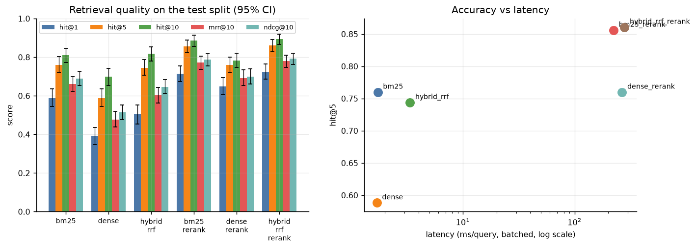
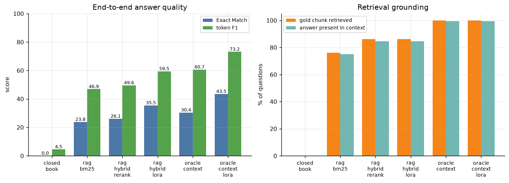
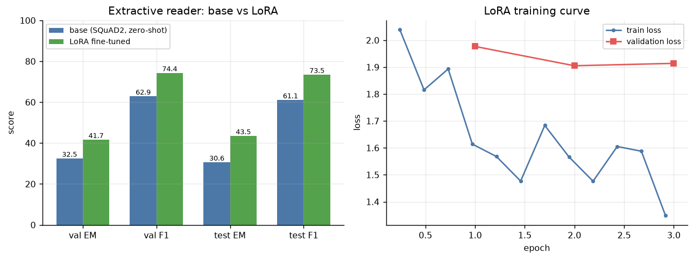
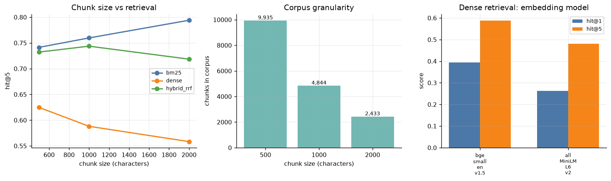
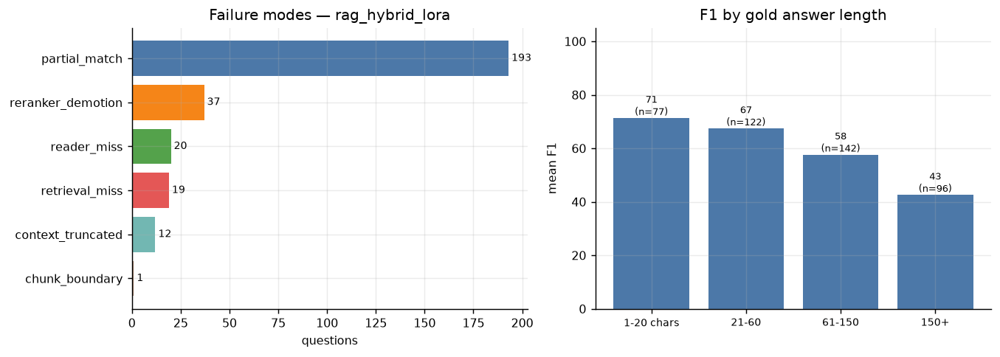
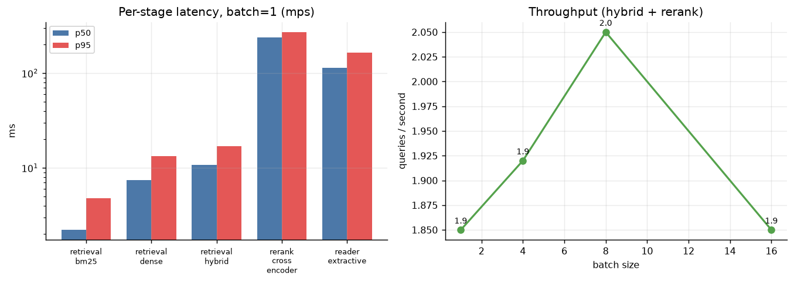

# Domain-Aware RAG & Fine-Tuned Transformer for Intelligent Document QA

Retrieval-augmented question answering over a corpus of **147 full-text biomedical
research papers**, built to *measure* retrieval and modelling choices rather than
just assemble them.

The project runs six retrieval configurations, a LoRA fine-tuning experiment, and
a five-way end-to-end comparison bracketed by two controls (no-retrieval floor and
oracle-context ceiling), so every claim decomposes into **retrieval error vs reader
error** instead of resting on a single aggregate score.

```
COVID-QA corpus ──► clean (offset-preserving) ──► sentence-aware chunking ──► metadata
                                                          │
                                    ┌─────────────────────┴─────────────────────┐
                                    ▼                                           ▼
                         BM25 lexical index                        bge-small embeddings
                                    │                                           │
                                    └──────────► RRF fusion ◄───────────────────┘  FAISS IndexFlatIP
                                                     │
                                        cross-encoder reranking (top-50 → top-5)
                                                     │
                                        context construction (chunk-boundary safe)
                                                     │
                        ┌────────────────────────────┴────────────────────────────┐
                        ▼                                                         ▼
        extractive reader (RoBERTa-SQuAD2)                      LoRA-adapted reader (0.47% params)
                        └────────────────────────────┬────────────────────────────┘
                                                     ▼
                                    answer + cited chunks + per-stage latency
```

> **Every number in this README was produced by a script in this repository and is
> read from a committed JSON file under `results/`.** Nothing is copied from a paper
> or estimated. Commands to regenerate all of it are in
> [Reproducibility](#14-reproducibility). Where a metric is a proxy rather than the
> real thing, it is labelled as such — see [§9](#9-what-the-metrics-do-and-do-not-measure).

---

## Table of contents

1. [Problem statement](#1-problem-statement)
2. [Why RAG](#2-why-rag)
3. [System architecture](#3-system-architecture)
4. [Dataset](#4-dataset)
5. [Models](#5-models)
6. [Retrieval approaches](#6-retrieval-approaches)
7. [Fine-tuning methodology](#7-fine-tuning-methodology)
8. [Experimental design](#8-experimental-design)
9. [What the metrics do and do not measure](#9-what-the-metrics-do-and-do-not-measure)
10. [Results](#10-results)
11. [Ablation study](#11-ablation-study)
12. [Error analysis](#12-error-analysis)
13. [Deployment and latency](#13-deployment-and-latency)
14. [Reproducibility](#14-reproducibility)
15. [Repository layout](#15-repository-layout)
16. [Limitations](#16-limitations)
17. [Future work](#17-future-work)

---

## 1. Problem statement

Given a corpus of long, domain-specific documents and a natural-language question,
return a **short, correct answer together with the exact passages it came from**, so
a reader can verify it.

The concrete task: 2,019 expert-annotated questions over 147 full-text CORD-19
papers. Documents run to a median of ~30,000 characters, so the answer to any
question occupies well under 1% of one document, and the correct passage must be
found before it can be read.

This is deliberately not framed as "build a chatbot". The engineering questions the
project answers are:

- Does dense retrieval actually beat lexical search on specialised vocabulary?
- Does hybrid fusion earn its complexity once a reranker is present?
- Is the bottleneck retrieval or the reader — and therefore what should be fixed first?
- Does domain adaptation of a general QA model pay for itself on ~1.2k examples?

## 2. Why RAG

**Measured, not asserted.** The closed-book control — the same generative model asked
the same questions with no retrieval — scores **0.00 Exact Match / 4.55 F1** on the
test split. Retrieval takes the identical model family to **59.46 F1**.

That gap is the entire justification. These papers are specific, recent and
technical; the parametric knowledge of a small open model contains essentially none
of it. RAG here is not a latency/cost optimisation over fine-tuning — it is the
difference between a working system and one that answers nothing.

Retrieval also buys two things a purely parametric model cannot:

- **Citations.** Every answer returns the chunk ids it came from, so it is checkable.
- **Structural non-hallucination.** With an extractive reader the answer is by
  construction a substring of retrieved text. Measured lexical groundedness is
  **100.0%** for every extractive RAG configuration, and the error analysis finds
  **0** hallucination-suspect cases. That is a property of the architecture, not a
  behaviour that had to be trained.

## 3. System architecture

| stage | module | what it does and why |
|---|---|---|
| Parsing / cleaning | `preprocessing/cleaning.py` | Collapses whitespace **while tracking an exact character offset map**. Answer labels are character offsets, so any cleaning step that silently shifts them corrupts every downstream label. Only whitespace is touched; de-hyphenation and header stripping were rejected as unsafe. |
| Chunking | `preprocessing/chunking.py` | Sentence-aware packing to ~1,000 chars with 200-char overlap. Chunks carry exact `[start_char, end_char)` spans, which is what lets retrieval ground truth be *derived* rather than assumed. |
| Metadata | `data/covidqa.py` | Per-chunk `doc_id`, document title, split. |
| Embedding | `retrieval/dense.py` | `bge-small-en-v1.5`, L2-normalised, with the asymmetric query instruction the model was trained with. |
| Vector index | `retrieval/dense.py` | FAISS `IndexFlatIP` = exact cosine on normalised vectors. At 4,844 chunks an approximate index would add tuning knobs and recall loss to a search that already takes ~10 ms. |
| Retrieval | `retrieval/{bm25,dense,hybrid}.py` | BM25, dense, or RRF fusion of both. |
| Reranking | `reranking/cross_encoder.py` | `ms-marco-MiniLM-L-6-v2` scores (query, passage) jointly; top-50 → top-5 cascade. |
| Context | `generation/pipeline.py` | Concatenates chunks in rank order, truncating **at chunk boundaries** — a half-chunk can cut an answer span in two and make the reader fail for a reason unrelated to retrieval. |
| Reader | `generation/readers.py` | Extractive span reader (default) or seq2seq generative reader, behind one interface. |
| Serving | `api/` | FastAPI: `/health`, `/retrieve`, `/query`, `/evaluate`. |

An index is never loaded unless its `manifest.json` matches the requested chunking
and embedding config — silently reusing an index built with a different chunk size is
the easiest way to produce a wrong experiment that still runs cleanly.

## 4. Dataset

**COVID-QA** ([`deepset/covid_qa_deepset`](https://huggingface.co/datasets/deepset/covid_qa_deepset),
Möller et al., ACL 2020 NLP-COVID workshop; Apache-2.0), over
[CORD-19](https://github.com/allenai/cord19) full texts.

| | measured |
|---|---:|
| Source documents | 147 |
| Corpus size | 3,863,049 characters |
| Chunks (1000/200, sentence) | 4,844 |
| Median chunk length | 920 chars |
| QA pairs | 2,019 |
| Questions with a derived gold chunk | 2,019 (100%) |
| Gold chunk contains the answer verbatim | **2,000 / 2,019 = 99.06%** |

### Why this dataset

| candidate | rejected because |
|---|---|
| SQuAD / SQuAD2 | Not domain-specific; paragraph-length contexts make chunking a non-decision; heavily tutorial-ised |
| HotpotQA, Natural Questions | Corpus too large for the available disk and CPU/MPS budget |
| PubMedQA | The context is *given* — it is yes/no/maybe classification, so the retrieval half of the project would be decorative |
| FiQA, SciFact (BEIR) | Real relevance labels, but no extractive answer spans → no objective reader metric, so the fine-tuning experiment would have nothing to measure |

COVID-QA is the only candidate that supports **both halves objectively**: character
offsets give exact EM/F1 for the reader *and* let retrieval ground truth be derived.

### Splits are by document, not by question

Several questions share a source paper. A question-level split would let a fine-tuned
reader see the test paper during training, inflating EM/F1 for reasons unrelated to
generalisation. Assignment is a stable hash of the document id, so adding or removing
a paper does not reshuffle the rest.

| split | documents | questions |
|---|---:|---:|
| train | 102 | 1,157 |
| validation | 26 | 425 |
| test | 19 | 437 |

The **retrieval corpus is all 147 documents in every split** — a deployed retriever
searches everything, and indexing only test documents would make retrieval
artificially easy.

### Deriving retrieval ground truth

A chunk is relevant if it contains the annotated answer span, computed from character
offsets rather than string matching. If a span straddles a boundary, every overlapping
chunk is marked relevant instead of dropping the question. The 19 cases (0.94%) where
no single chunk contains the answer verbatim are long answers (300–933 chars); they are
a genuine ceiling on extractive performance and are counted as `chunk_boundary` failures
rather than hidden.

## 5. Models

All chosen to run on a 16 GB laptop with no CUDA (Apple MPS), which is a real
constraint, not a stylistic preference.

| role | model | params | why |
|---|---|---:|---|
| Embedder | `BAAI/bge-small-en-v1.5` | 33 M | Strong BEIR results per parameter; trained with an asymmetric query instruction |
| Embedder (ablation) | `all-MiniLM-L6-v2` | 22 M | Symmetric baseline, to test whether the loss to BM25 was model-specific |
| Reranker | `cross-encoder/ms-marco-MiniLM-L-6-v2` | 22 M | Standard MS MARCO cross-encoder |
| Reader (default) | `deepset/roberta-base-squad2` | 125 M | Already SQuAD2-tuned, so the experiment measures **domain adaptation**, not learning QA |
| Reader (generative) | `google/flan-t5-base` | 248 M | Closed-book control; also the swappable generative path |

## 6. Retrieval approaches

**BM25** (`rank_bm25`, k1=1.5, b=0.75). Tokenisation preserves hyphenated terms —
splitting `SARS-CoV-2` into three tokens destroys the most discriminative term in the
corpus. The stoplist is deliberately short; aggressive removal hurts biomedical queries
where words like "between" carry relational meaning.

**Dense** — `bge-small` + FAISS `IndexFlatIP` over normalised vectors (exact cosine).

**Hybrid, by Reciprocal Rank Fusion**, not weighted score summing:

```
RRF(d) = Σ_r  1 / (k + rank_r(d)),   k = 60
```

BM25 scores are unbounded and corpus-dependent; cosine lives in [−1, 1]. A weighted
sum needs per-corpus normalisation and a tuned weight that will not transfer, and the
validation split here is small enough that a tuned weight would mostly fit noise. RRF
fuses *ranks*, is scale-free and has one insensitive hyperparameter. The cost is that
it discards score magnitude — a document BM25 is overwhelmingly confident about is
treated the same as a merely top-ranked one, which turns out to matter (§10).

**Cross-encoder reranking.** A bi-encoder must compress a passage into one vector
before it sees the query, so it cannot model term-level interaction. A cross-encoder
reads the pair jointly — far more accurate, far more expensive (O(candidates) forward
passes). Hence the two-stage cascade: retrieve 50 cheaply, rerank to 5. First-stage
recall at depth 50 is a hard ceiling on what reranking can recover.

## 7. Fine-tuning methodology

**Task.** Extractive span prediction (start/end logits) — the objective COVID-QA is
annotated for, so EM/F1 measure the model rather than a formatting convention.

**Why LoRA over full fine-tuning.** ~1.2k training questions over 102 documents. Full
fine-tuning of 125 M parameters on that little in-domain data overfits quickly and
needs a full optimiser state (~3× model size) in memory. LoRA freezes the backbone and
learns rank-16 updates to the attention query/value projections, preserving the strong
SQuAD2 prior instead of washing it out.

| | measured |
|---|---:|
| Base model | `deepset/roberta-base-squad2` |
| Total parameters | 124,647,940 |
| **Trainable parameters** | **591,362** |
| **Trainable share** | **0.474%** |
| LoRA rank / alpha / dropout | 16 / 32 / 0.1 |
| Target modules | `query`, `value` (+ `qa_outputs` head, which must be trained) |
| Learning rate | 3e-4 (LoRA updates are low-rank and need ~10× a full-FT LR) |
| Epochs / batch / max seq | 3 / 8 / 384 |
| Optimisation steps | 432 |
| **Training time** | **598.5 s (9.97 min)** on Apple MPS, fp32 |
| Train / val / test reader examples | 1,151 / 415 / 434 |
| Final training loss | 1.625 |
| Validation loss by epoch | 1.977 → 1.905 → 1.914 |

Validation loss flattens and ticks up slightly at epoch 3 while test EM/F1 still
improve — consistent with mild overfitting beginning, and the reason epochs were not
increased.

**Training context is the gold chunk**, giving clean span supervision. This introduces
a train/inference mismatch — at inference the reader sees *retrieved* context
containing distractors. Training on retrieved context instead would entangle reader
quality with retriever quality and make the ablation uninterpretable. The mismatch is
a real limitation (§16), and the oracle-vs-retrieved gap in §10 measures its size.

## 8. Experimental design

| | |
|---|---|
| Test split | 437 questions over 19 unseen documents |
| Retrieval corpus | all 4,844 chunks from all 147 documents |
| Confidence intervals | percentile bootstrap, 1,000 resamples |
| System comparisons | **paired** bootstrap, 10,000 resamples |
| Tracking | MLflow (SQLite backend), 23 runs logged |
| Seeding | Python / NumPy / torch seeded per run; document splits hash-based |

Comparisons are **paired** because both systems are scored on exactly the same
questions; pairing removes question difficulty as a variance source and gives an
honest test rather than a flattering one.

Two controls bracket every RAG number:

- **`closed_book`** — no retrieval. The floor.
- **`oracle_context`** — the gold chunk handed directly to the reader. The ceiling.

Without them, an F1 of 49.6 says nothing about *which component* to fix.

## 9. What the metrics do and do not measure

**EM / token-F1** follow the official SQuAD v1.1 normalisation, with one documented
deviation: Unicode punctuation is stripped as well as ASCII. CORD-19 contains U+2010
hyphens, so a model answering `HCoV-HKU1` against gold `HCoV‐HKU1` would otherwise be
scored wrong on a purely typographic difference. The change only ever *removes*
characters, so it cannot turn a wrong answer into a right one.

**`hit@k` vs `recall@k`.** Both are reported because they answer different questions.
Overlapping chunks mean a question can have several near-duplicate gold chunks, so
finding one of them caps `recall@k` below 1.0 even though the answer was found.
`hit@k` — did *any* gold chunk make the top k — is the operationally meaningful one
for RAG, and is used as the headline.

**RAGAS was considered and not used.** Its faithfulness and answer-relevance metrics
require an LLM judge, which means an API key and a non-reproducible, drifting
evaluator. Instead two *lexical proxies* are computed and labelled as proxies:

- **`groundedness_proxy`** — share of answer tokens present in the retrieved context.
  It catches the clearest hallucination mode but **cannot** detect an answer that
  recombines context tokens into a false claim, and it under-scores correct
  paraphrases. For an extractive reader it is ~100 by construction and therefore
  near-vacuous; it is meaningful only for the generative path.
- **`context_relevance`** — precision of retrieved chunks against gold.

Calling either of these "faithfulness" would overstate them.

## 10. Results

### 10.1 Retrieval — 437 test questions, 4,844 chunks



| system | hit@1 | hit@5 | hit@10 | recall@10 | MRR@10 | nDCG@10 | ms/query |
|---|---:|---:|---:|---:|---:|---:|---:|
| BM25 | 0.588 | 0.760 | 0.810 | 0.797 | 0.660 | 0.689 | 1.7 |
| Dense (bge-small) | 0.394 | 0.588 | 0.698 | 0.674 | 0.477 | 0.513 | 1.7 |
| Hybrid RRF | 0.503 | 0.744 | 0.817 | 0.804 | 0.604 | 0.646 | 3.4 |
| BM25 + rerank | 0.714 | 0.856 | 0.886 | 0.876 | 0.771 | 0.788 | 223.2 |
| Dense + rerank | 0.648 | 0.760 | 0.783 | 0.768 | 0.692 | 0.699 | 265.8 |
| **Hybrid + rerank** | **0.725** | **0.860** | **0.892** | **0.878** | **0.779** | **0.791** | 279.6 |

Paired bootstrap, 10,000 resamples:

| comparison | metric | Δ | 95% CI | p | verdict |
|---|---|---:|---|---:|---|
| Dense vs BM25 | hit@1 | −0.195 | [−0.249, −0.142] | <0.0001 | **dense is significantly worse** |
| Hybrid RRF vs BM25 | MRR@10 | −0.056 | [−0.089, −0.024] | 0.0004 | **fusion significantly hurts** |
| BM25+rerank vs BM25 | hit@1 | +0.126 | [+0.085, +0.167] | <0.0001 | **reranking is the real gain** |
| Hybrid+rerank vs BM25+rerank | hit@1 | +0.011 | [+0.000, +0.023] | 0.069 | not significant |
| Hybrid+rerank vs BM25+rerank | hit@5 | +0.005 | [−0.014, +0.023] | 0.719 | not significant |

**Three findings that contradict the usual RAG narrative:**

1. **Dense retrieval loses badly to BM25** (−0.195 hit@1, p<0.0001). COVID-QA questions
   turn on rare exact tokens (`DC-SIGNR`, `onset-to-death`) that IDF weighting exploits
   and a 384-dim general-domain embedding blurs. The embedding ablation (§11) confirms
   this is domain mismatch, not a bad model choice.
2. **RRF hybrid is *worse* than BM25 alone** on MRR@10 (p=0.0004). Fusing a much weaker
   ranker at equal weight costs top-rank precision. Hybrid is not free.
3. **The cross-encoder does essentially all the work**, and **hybrid fusion adds nothing
   measurable on top of it** (p=0.069 on the single best-case metric; p>0.15 elsewhere).

**Engineering conclusion:** `bm25_rerank` is statistically indistinguishable from the
full hybrid pipeline at **56 ms/query less latency**, with no embedding model and no
FAISS index at serving time. The default config keeps hybrid because it has the best
point estimate on every metric, but on this corpus that preference is *not* supported
by evidence, and BM25 + rerank is the better engineering choice if latency matters.

### 10.2 End-to-end RAG — 437 test questions



| system | EM | F1 | answer in context | gold retrieved | groundedness proxy | ms/query |
|---|---:|---:|---:|---:|---:|---:|
| `closed_book` (no retrieval) | 0.00 | 4.55 | 0.0 | 0.0 | 0.0 | 43 |
| `rag_bm25` | 23.80 | 46.91 | 75.1 | 76.0 | 100.0 | 125 |
| `rag_hybrid_rerank` | 26.09 | 49.58 | 84.7 | 86.0 | 100.0 | 899 |
| **`rag_hybrid_lora`** | **35.47** | **59.46** | 84.7 | 86.0 | 100.0 | 1021 |
| `oracle_context` (base reader) | 30.43 | 60.70 | 99.3 | 100.0 | 99.5 | 38 |
| `oracle_context_lora` (ceiling) | 43.48 | 73.19 | 99.3 | 100.0 | 99.8 | 26 |

### 10.3 The decomposition — where the errors actually are

Reading the 2×2 of {base, LoRA} reader × {retrieved, oracle} context, in F1:

| | retrieved context | oracle context | **cost of imperfect retrieval** |
|---|---:|---:|---:|
| base reader | 49.58 | 60.70 | **−11.12** |
| LoRA reader | 59.46 | 73.19 | **−13.73** |
| **gain from fine-tuning** | **+9.88** | **+12.49** | |

- **Retrieval error costs ~11–14 F1.** Fixing retrieval entirely would buy that much.
- **Reader error costs ~27 F1** (100 − 73.19) *even with perfect context*. The reader
  is the larger bottleneck by roughly 2×.
- This is why fine-tuning (+9.88 F1) bought more than upgrading retrieval (+2.67 F1),
  and it is the kind of conclusion a single aggregate score cannot support.
- **`rag_hybrid_lora` (59.46) ≈ `oracle_context` with the base reader (60.70).**
  Domain-adapting the reader recovered almost as much as *perfect retrieval* would have.

### 10.4 Fine-tuning



Reader in isolation, on gold chunks — this isolates the model from retrieval:

| model | val EM | val F1 | test EM | test F1 |
|---|---:|---:|---:|---:|
| base (`roberta-base-squad2`, zero-shot) | 32.53 | 62.91 | 30.65 | 61.10 |
| **LoRA fine-tuned** | **41.69** | **74.36** | **43.55** | **73.50** |
| **Δ** | +9.16 | +11.45 | **+12.90** | **+12.40** |

Training **591,362 parameters (0.474% of 124.6 M)** for **9.97 minutes** on a laptop GPU
produced +12.90 EM / +12.40 F1. Validation and test move together, so this is domain
adaptation rather than test-set overfitting.

## 11. Ablation study



### Chunk size (overlap fixed at 20%)

| chunk size | chunks | BM25 hit@5 | dense hit@5 | hybrid hit@5 |
|---:|---:|---:|---:|---:|
| 500 | 9,935 | 0.741 | 0.625 | 0.732 |
| 1,000 | 4,844 | 0.760 | 0.588 | 0.744 |
| 2,000 | 2,433 | 0.794 | 0.558 | 0.719 |

**Dense degrades monotonically as chunks grow** (0.625 → 0.558) — a bi-encoder must
compress the whole passage into one 384-dim vector, and more text per chunk means more
dilution. BM25 improves, because more terms per chunk means more chances to match and
IDF weighting is unaffected by length.

*Methodological caveat:* `hit@k` is not perfectly comparable across chunk sizes, because
the retrieval unit itself changes — larger chunks make each hit cover more text. The
directional split between BM25 and dense is the trustworthy signal here, not the
absolute values.

### Embedding model (dense retrieval, chunk size 1,000)

| model | hit@1 | hit@5 | MRR@10 |
|---|---:|---:|---:|
| `bge-small-en-v1.5` | 0.394 | 0.588 | 0.477 |
| `all-MiniLM-L6-v2` | 0.263 | 0.481 | 0.352 |

`bge-small` is clearly the better of the two, and **both lose decisively to BM25's
0.588 hit@1**. The dense deficit is a domain-mismatch property of general-purpose
sentence embeddings on biomedical text, not an artefact of picking a weak model.

## 12. Error analysis



Every failure of the best system (`rag_hybrid_lora`) assigned to exactly one category,
in priority order — retrieval causes are tested before reader causes, since a question
whose gold chunk was never retrieved is a retrieval failure regardless of what the
reader then said.

| category | count | share of failures | what it means |
|---|---:|---:|---|
| *(correct, F1 = 1.0)* | 155 / 437 | — | 35.5% exactly right |
| `partial_match` | 193 | 68.4% | Right region, different span boundaries |
| `reranker_demotion` | 37 | 13.1% | First stage found the gold chunk; **the reranker pushed it out of the top-5** |
| `reader_miss` | 20 | 7.1% | Answer was in the context; the reader still missed it |
| `retrieval_miss` | 19 | 6.7% | Gold chunk not in the top-50 at all |
| `context_truncated` | 12 | 4.3% | Gold chunk retrieved but fell outside the 4,000-char window |
| `chunk_boundary` | 1 | 0.4% | Answer straddles two chunks; no single chunk contains it |
| `hallucination_suspect` | **0** | 0% | Structurally impossible for an extractive reader |

**The most useful finding:** the cross-encoder is *simultaneously* the single biggest
source of retrieval gain (§10.1) and the second-largest failure category. It demotes
the correct chunk in **37 cases — nearly 2× the 19 the first stage misses entirely**.
A reranker is not a free accuracy upgrade; it is a model that can be confidently wrong,
and this is invisible to aggregate retrieval metrics.

**`partial_match` dominates** (68.4%), which is a statement about the task as much as
the model: COVID-QA answers are expert-selected spans that often run to whole sentences,
and F1 by gold answer length shows the effect directly:

| gold answer length | n | mean F1 |
|---|---:|---:|
| 1–20 chars | 77 | 71.32 |
| 21–60 | 122 | 67.42 |
| 61–150 | 142 | 57.61 |
| 150+ | 96 | 42.58 |

Performance falls by **29 F1 points** from the shortest to the longest bucket. Much of
the headline error is boundary disagreement on long answers, not wrong retrieval —
which again points at the reader, consistent with §10.3.

Worked examples for every category, with the actual retrieved and gold chunk ids, are in
[`results/error_analysis/error_analysis.md`](results/error_analysis/error_analysis.md).

## 13. Deployment and latency

### Service

```
GET  /health     device, loaded models, chunk count, uptime
POST /retrieve   ranked chunks with scores; method and reranking overridable per request
POST /query      answer + cited chunks + per-stage latency + model info
POST /evaluate   batch scoring with the same metrics as the offline harness
```

Models load once at startup, not per request. Every response carries an
`X-Request-ID`, server-side timing, and the model identifiers that produced it, so a
served answer can be traced to an exact configuration. The Docker image is a two-stage
build on CPU-only torch wheels, runs as a non-root user, and its healthcheck reports
`index_loaded` so an orchestrator can distinguish "process up" from "actually ready".

### Measured latency — Apple M-series MPS, 4,844 chunks, 50 queries



| stage | p50 | p95 | p99 | mean |
|---|---:|---:|---:|---:|
| BM25 retrieval | 2.22 | 4.80 | 6.73 | 2.44 |
| Dense retrieval (FAISS) | 7.45 | 13.37 | 15.76 | 8.93 |
| Hybrid retrieval | 10.84 | 16.93 | 17.20 | 11.30 |
| **Cross-encoder rerank** | **239.86** | 271.56 | 404.08 | 243.86 |
| Extractive reader | 113.51 | 165.55 | 166.56 | 133.70 |
| End-to-end, BM25 no rerank | 127.16 | 173.87 | 180.59 | 130.77 |
| End-to-end, hybrid + rerank | 431.98 | 494.64 | 618.71 | 434.90 |

All figures in ms, batch size 1, after warm-up (the first MPS calls include lazy kernel
compilation and would otherwise dominate p99).

**Reranking is 96% of retrieval latency** — 240 ms against 11 ms for hybrid retrieval —
and buys +0.126 hit@1. That is the central accuracy/latency trade-off, and it is why
§10.1's finding that hybrid fusion adds nothing on top matters: the fusion costs
latency for no measurable accuracy.

Throughput: **1.85–2.05 queries/s**; batching from 1 to 16 barely helps, because a single
MPS device is already saturated by the cross-encoder's 50 pairs per query. Resident
memory after loading all four models: **660 MB**.

*These are CPU/MPS numbers on a laptop with no CUDA. They are not a claim about
production hardware.*

## 14. Reproducibility

```bash
git clone <this-repo> && cd domain-rag-qa
python -m venv .venv && source .venv/bin/activate
pip install -r requirements.txt
pip install -e .

pytest                                          # 76 tests, no downloads, ~0.3 s

python scripts/prepare_data.py                  # download, clean, chunk, derive labels
python scripts/build_index.py                   # embed + FAISS index      (~45 s)
python scripts/evaluate_retrieval.py            # Phase 1-2: 6 systems     (~7 min)
python scripts/run_experiments.py --ablation all  # chunk size + embedder  (~5 min)
python scripts/train.py                         # Phase 4: LoRA            (~10 min)
python scripts/evaluate_rag.py                  # Phase 5: 6 systems       (~16 min)
python scripts/error_analysis.py --system rag_hybrid_lora
python scripts/benchmark.py                     # Phase 8: latency
python scripts/make_figures.py                  # all README figures

mlflow ui --backend-store-uri sqlite:///mlflow.db   # 23 tracked runs
```

Serve it:

```bash
uvicorn rag_system.api.main:app --reload    # needs PYTHONPATH=src, or `pip install -e .`
# or, with the prebuilt index mounted:
docker compose up --build
```

```bash
python app/demo.py -q "What is the most common species of Human Coronavirus among adults?"
```

**Determinism.** All hyperparameters live in `configs/*.yaml`; unknown keys raise
rather than being silently ignored. Every run dumps its resolved config beside its
results. Document splits are hash-based, so they are stable under corpus changes.
Generation is greedy (`do_sample=False`).

> **`OMP_NUM_THREADS=1` is set in `src/rag_system/__init__.py` and must stay.**
> `faiss-cpu` and `torch` each bundle their own `libomp.dylib`; two OpenMP runtimes in
> one process caused bare segfaults with no traceback, and *which* call crashed depended
> on import order (faiss-first killed Flan-T5 weight loading; torch-first-with-lazy-faiss
> killed FAISS search). Pinning torch→faiss import order plus a single OpenMP thread is
> the only configuration that survived every code path. Measured cost at this corpus
> size: none.

## 15. Repository layout

```
configs/            retrieval.yaml · rag.yaml · finetuning.yaml
src/rag_system/
  data/             covidqa.py (corpus + derived gold labels) · store.py (artefacts, manifest checks)
  preprocessing/    cleaning.py (offset-preserving) · chunking.py
  retrieval/        base.py · bm25.py · dense.py (FAISS) · hybrid.py (RRF) · factory.py
  reranking/        cross_encoder.py
  generation/       readers.py (extractive + generative) · pipeline.py
  finetuning/       qa_data.py (features + span postprocessing) · train_qa.py (LoRA)
  evaluation/       retrieval_metrics.py · qa_metrics.py · error_analysis.py · runner.py
  api/              main.py · schemas.py · service.py
  utils/            config.py · runtime.py · tracking.py
scripts/            prepare_data · build_index · evaluate_retrieval · run_experiments
                    train · evaluate_rag · error_analysis · benchmark · make_figures
tests/              76 tests: chunking, retrieval, metrics, config, pipeline, API
results/            retrieval/ · finetuning/ · rag/ · benchmarks/ · error_analysis/ · figures/
app/demo.py         terminal demo
Dockerfile · docker-compose.yml
```

## 16. Limitations

Real constraints on what these results support.

- **One corpus, one domain.** Every finding — especially "BM25 beats dense" — is a
  statement about 147 biomedical papers with dense technical vocabulary. On
  conversational or paraphrase-heavy queries the ordering would likely reverse.
- **Single seed for fine-tuning.** The LoRA run was not repeated across seeds, so
  +12.90 EM has no variance estimate. Retrieval comparisons *do* have bootstrap CIs
  and paired tests; the fine-tuning delta does not.
- **No hyperparameter search.** LoRA rank, alpha, learning rate, `top_k`, `candidate_k`
  and `rrf_k` were set to standard values and shared across systems for fairness, not
  tuned. A tuned dense retriever or a tuned RRF weight might place differently.
- **Train/inference mismatch for the reader.** It is fine-tuned on gold chunks but
  serves on retrieved context with distractors. §10.3 measures the size of the gap
  (11–14 F1) but does not close it.
- **Faithfulness is a lexical proxy, not an LLM judge.** See §9. For the extractive
  reader it is ~100 by construction and therefore close to uninformative.
- **`hit@k` is not comparable across chunk sizes** — the retrieval unit changes with
  the chunk size, so §11's absolute values shift for reasons unrelated to quality.
- **Small test split.** 437 questions over 19 documents. Differences under ~4 points
  are within bootstrap noise; this is exactly why the paired tests are reported.
- **Extractive reader cannot answer non-span questions.** It is the right choice for
  COVID-QA, whose answers *are* spans, but it cannot synthesise across passages.
- **CPU/MPS laptop latency**, no CUDA, no load testing, no concurrency benchmark. The
  throughput numbers describe one process on one device.
- **19 questions (0.94%) have answers that no single chunk contains** — a hard ceiling
  on extractive performance built into the chunking.

## 17. Future work

Ordered by what the error analysis says would actually pay:

1. **Fix reranker demotion first** (13.1% of failures). Score-calibrate or ensemble the
   cross-encoder with the first-stage score instead of discarding it, or keep a
   guaranteed slot for the top first-stage hit.
2. **Attack `partial_match`** (68.4% of failures) — train with a span-boundary-aware
   objective, or evaluate with a boundary-tolerant metric alongside strict EM.
3. **Fine-tune the reader on retrieved context** to remove the train/inference mismatch.
4. **Domain-adapt the embedder** (e.g. `BioBERT`/`SPECTER`-initialised, or contrastive
   training on in-domain pairs) and re-test whether dense can close the gap to BM25.
5. **Multi-seed everything**, with variance on the fine-tuning delta.
6. **Quantise or distil the cross-encoder** — it is 96% of retrieval latency.
